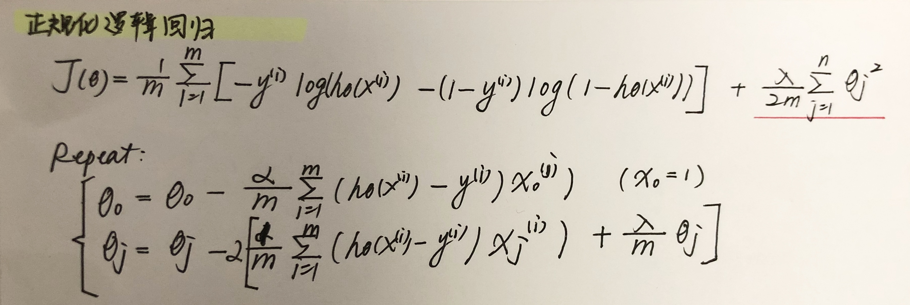

# 正则化处理 逻辑回归

逻辑回归 有损函数:
$J(\theta) = 1/m * sum(-ylog(h_\theta(x) - (1-y)log(1 - h_\theta(x))))$

逻辑回归 有损函数 with regularization:
$J(\theta) = 1/m * sum(-ylog(h_\theta(x) - (1-y)log(1 - h_\theta(x)))) + \lambda/2m * sum(\theta^2)$

梯度下降:
$w = w - alpha / m * [sum((h_\theta(x) - y) x) + \lambda \theta]$



```python
# (4) weights
# weights_3_1 -= alpha * dW_3_1 / n
# => + lamdaba * weights

weights_3_1 -= alpha * (dW_3_1 + lambda_data * weights_3_1) / n
```

## 疑问 TODO
1. $\lambda$ 取值范围是什么?
2. 太大, 会导致high bias